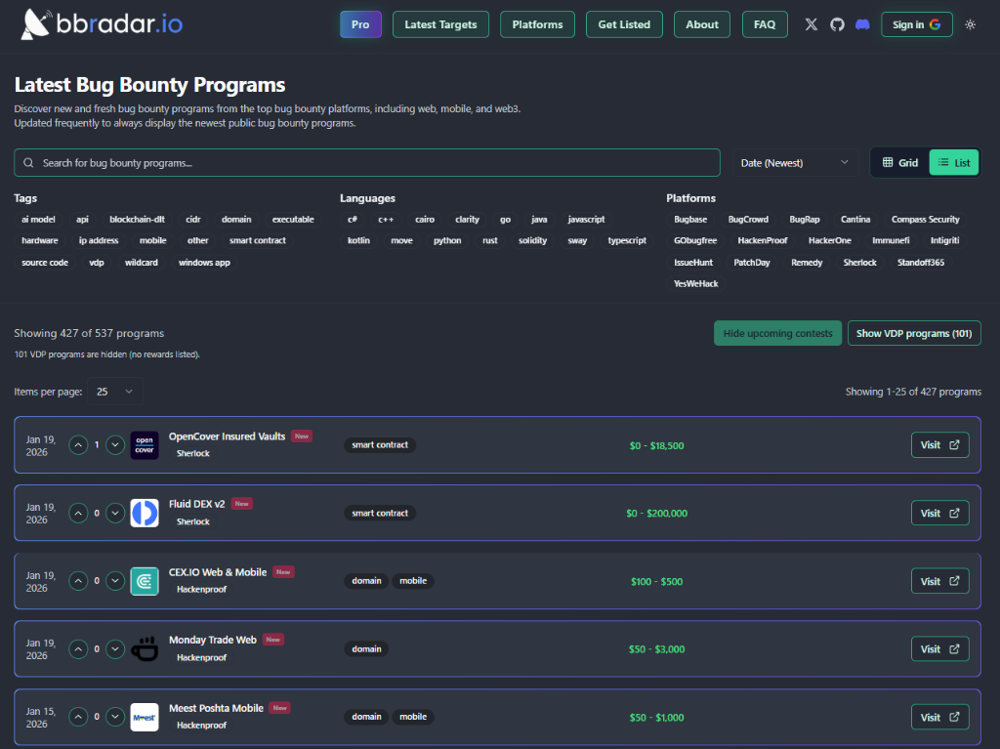
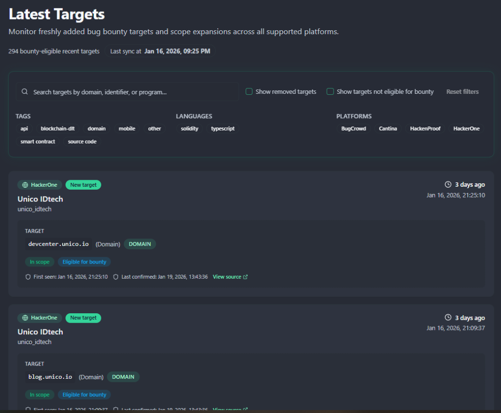
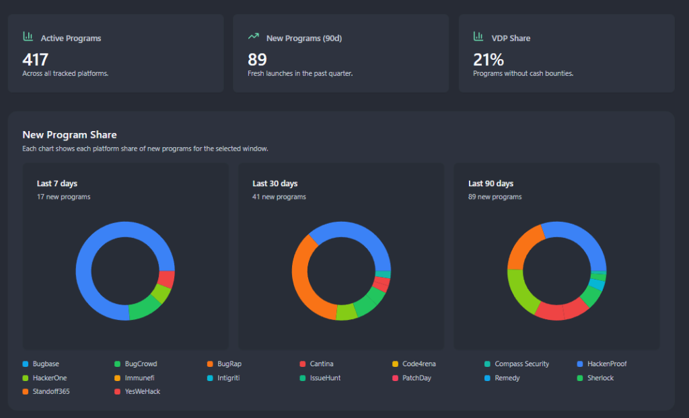
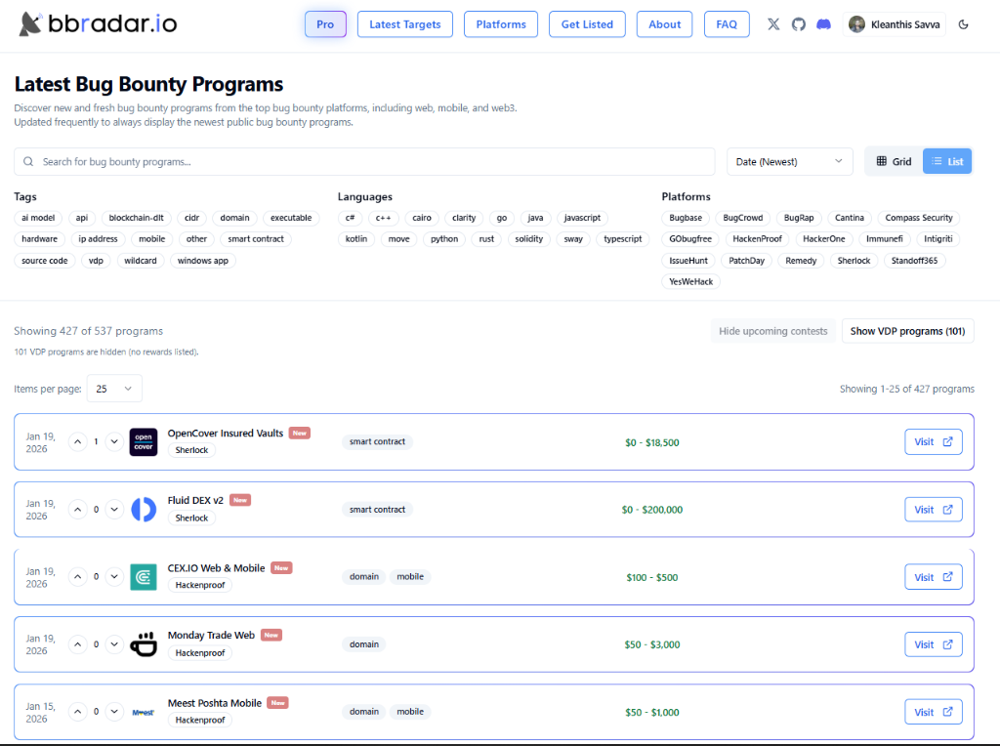
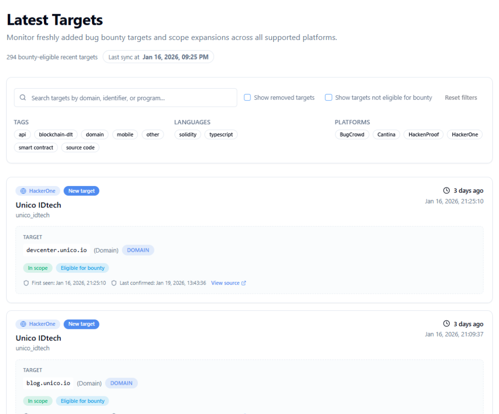

# [bbradar.io](https://bbradar.io)

The latest public bug bounty programs in one place across all major platforms - HackerOne, Bugcrowd, Intigriti, YesWeHack, Immunefi, and many more.

````carousel

<!-- slide -->

<!-- slide -->

<!-- slide -->

<!-- slide -->

````

## Website
Visit the website: https://bbradar.io

## Overview
Bug Bounty Radar (bbradar.io) is a fast, comprehensive aggregator for publicly listed bug bounty and vulnerability disclosure programs. Updated multiple times per hour with powerful filtering capabilities, it helps you discover programs that match your skills and tech stack across both Web2 and Web3 ecosystems.

## At a Glance

<table>
  <tr>
    <td><strong>Scope</strong></td>
    <td>Public bug bounty and VDP listings</td>
  </tr>
  <tr>
    <td><strong>Platforms</strong></td>
    <td>HackerOne, Bugcrowd, Intigriti, YesWeHack, Immunefi, Code4rena, CodeHawks, Sherlock, HackenProof, BugBase, PatchDay, Compass Security, Remedy, Standoff365, IssueHunt, BugRap, Cantina, GoBugFree</td>
  </tr>
  <tr>
    <td><strong>Program types</strong></td>
    <td>Web, API, Mobile, Smart Contracts, Blockchain, and more</td>
  </tr>
  <tr>
    <td><strong>Data points</strong></td>
    <td>Program, Platform, Type and Tags, Reward Range, Scope, Status, Date</td>
  </tr>
  <tr>
    <td><strong>Filters and search</strong></td>
    <td>Keyword search, tags, program type, language, platform filters</td>
  </tr>
  <tr>
    <td><strong>Update cadence</strong></td>
    <td>Refreshes multiple times per hour ⚡</td>
  </tr>
  <tr>
    <td><strong>Access</strong></td>
    <td>Free tier available, Pro subscription for advanced features</td>
  </tr>
</table>

## Key Features

- **Unified Feed** - Track public programs across all major bug bounty platforms (Web2 and Web3) in one place
- **Latest Targets** - Monitor freshly added bug bounty targets and scope expansions across all supported platforms with real-time updates
- **Analytics Dashboard** - View comprehensive statistics including active programs (417+), new programs (90+ per quarter), VDP share (21%), and platform distribution insights
- **Powerful Discovery** - Filter by type (web, API, mobile, smart contracts), tags, languages, and platforms
- **Bounty Awareness** - Surface bounty amounts and reward ranges when available
- **Pro Subscription** - Unlock advanced features and enhanced monitoring capabilities
- **Dark/Light Mode** - Choose your preferred theme for comfortable browsing
- **Clean UX** - Minimal, fast interface built for efficient scanning and research
- **Web2 and Web3 Views** - Switch focus between ecosystems with a single click

## Supported Platforms

<table>
  <tr>
    <td><a href="http://bbradar.io/platforms/hackerone">HackerOne</a></td>
    <td><a href="http://bbradar.io/platforms/bugcrowd">Bugcrowd</a></td>
  </tr>
  <tr>
    <td><a href="http://bbradar.io/platforms/intigriti">Intigriti</a></td>
    <td><a href="http://bbradar.io/platforms/yeswehack">YesWeHack</a></td>
  </tr>
  <tr>
    <td><a href="http://bbradar.io/platforms/immunefi">Immunefi</a></td>
    <td><a href="http://bbradar.io/platforms/code4rena">Code4rena</a></td>
  </tr>
  <tr>
    <td><a href="http://bbradar.io/platforms/sherlock">Sherlock</a></td>
    <td><a href="http://bbradar.io/platforms/hackenproof">HackenProof</a></td>
  </tr>
  <tr>
    <td><a href="http://bbradar.io/platforms/bugbase">BugBase</a></td>
    <td><a href="http://bbradar.io/platforms/patchday">PatchDay</a></td>
  </tr>
  <tr>
    <td><a href="http://bbradar.io/platforms/compass-security">Compass Security</a></td>
    <td><a href="http://bbradar.io/platforms/remedy">Remedy</a></td>
  </tr>
  <tr>
    <td><a href="http://bbradar.io/platforms/standoff365">Standoff365</a></td>
    <td><a href="http://bbradar.io/platforms/issuehunt">IssueHunt</a></td>
  </tr>
  <tr>
    <td><a href="http://bbradar.io/platforms/bugrap">BugRap</a></td>
    <td><a href="http://bbradar.io/platforms/codehawks">CodeHawks</a></td>
  </tr>
  <tr>
    <td><a href="http://bbradar.io/platforms/cantina">Cantina</a></td>
    <td><a href="http://bbradar.io/platforms/gobugfree">GoBugFree</a></td>
  </tr>
</table>

New platforms are added regularly. Want one added? Open an issue or <a href="https://twitter.com/kleoz_">DM on 𝕏</a>.

## Program Types

<table>
  <tr>
    <td><a href="http://bbradar.io/tags/api">API</a></td>
    <td><a href="http://bbradar.io/tags/blockchain-dlt">Blockchain DLT</a></td>
  </tr>
  <tr>
    <td><a href="http://bbradar.io/tags/cidr">CIDR</a></td>
    <td><a href="http://bbradar.io/tags/domain">Domain</a></td>
  </tr>
  <tr>
    <td><a href="http://bbradar.io/tags/executable">Executable</a></td>
    <td><a href="http://bbradar.io/tags/hardware">Hardware</a></td>
  </tr>
  <tr>
    <td><a href="http://bbradar.io/tags/ip-address">IP Address</a></td>
    <td><a href="http://bbradar.io/tags/mobile">Mobile</a></td>
  </tr>
  <tr>
    <td><a href="http://bbradar.io/tags/other">Other</a></td>
    <td><a href="http://bbradar.io/tags/smart-contract">Smart Contract</a></td>
  </tr>
  <tr>
    <td><a href="http://bbradar.io/tags/source-code">Source Code</a></td>
    <td><a href="http://bbradar.io/tags/wildcard">Wildcard</a></td>
  </tr>
</table>

## Why bbradar.io
Manually checking multiple platforms is slow and inefficient. bbradar.io gives you a single, unified, real-time view of new public bug bounty and VDP programs across all major platforms. Discover targets faster, monitor scope changes, analyze trends, and spend your time on research instead of tab hopping.

## Helpful Links

<ul>
  <li><a href="https://bbradar.io/pro">Pro Subscription</a></li>
  <li><a href="https://bbradar.io/latest-targets">Latest Targets</a></li>
  <li><a href="https://bbradar.io/platforms">All Platforms</a></li>
  <li><a href="https://bbradar.io/get-listed">Get Listed for platforms</a></li>
  <li><a href="https://bbradar.io/faq">FAQ</a></li>
  <li><a href="https://bbradar.io">Website</a></li>
</ul>

## Contributing
Have an idea, found a bug, or want a new platform supported? Please open an <a href="https://github.com/bbradar-io/bbradar.io/issues">issue</a>.

## Contact Kleoz

<ul>
  <li><a href="https://twitter.com/kleoz_">𝕏 or Twitter</a></li>
  <li><a href="https://discord.gg/bbradar">Discord</a></li>
  <li><a href="mailto:hello@bbradar.io">Email</a></li>
  <li><a href="https://github.com/bbradar-io/bbradar.io/issues">Issues</a></li>
</ul>

If you are a platform owner or researcher with feedback, feel free to reach out.

<hr>

If you find bbradar.io useful, please star this repo and share the site. It helps other researchers discover new programs faster. 🔎
