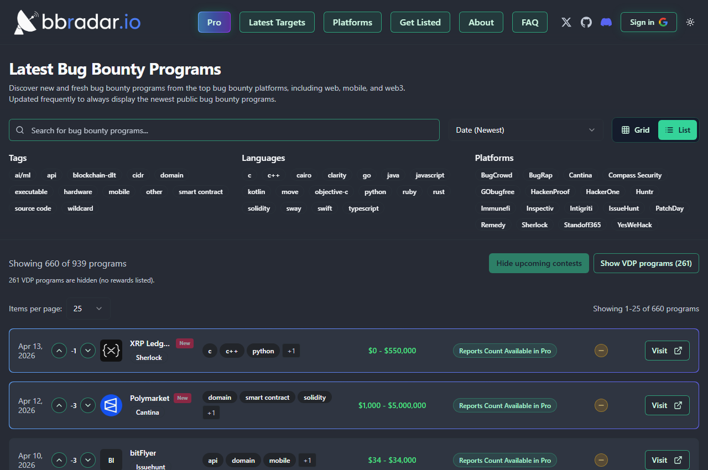
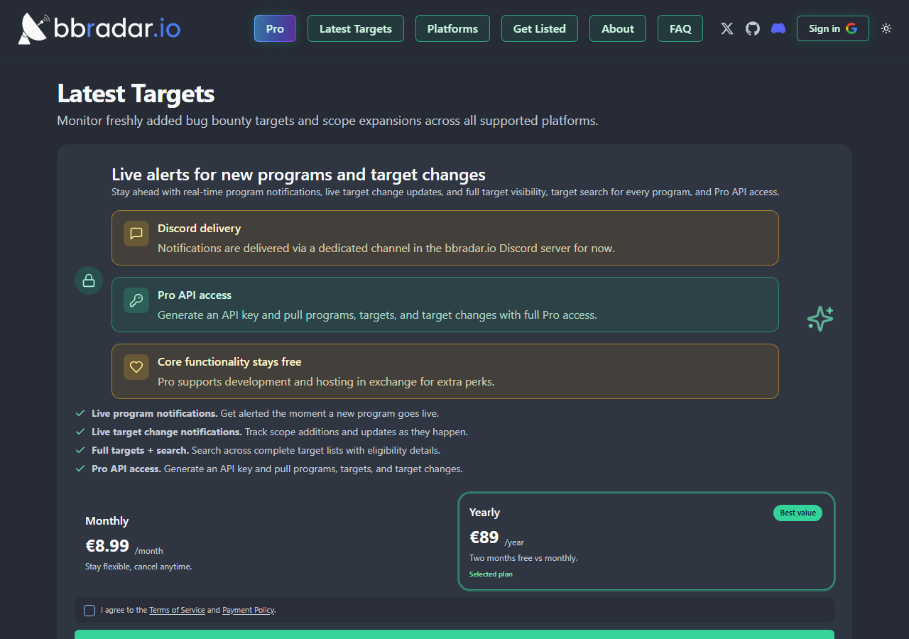
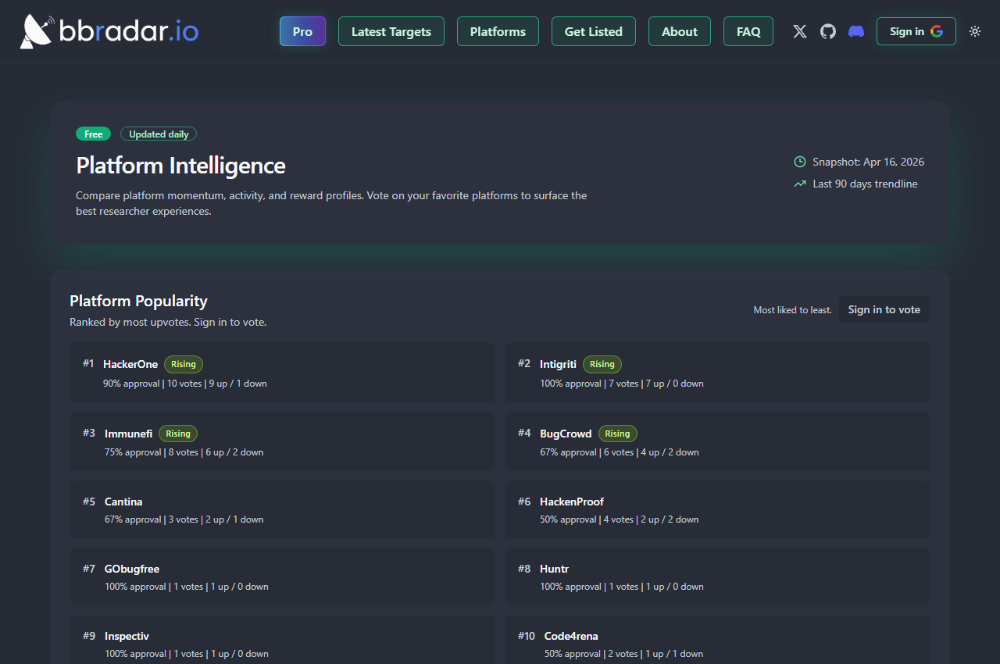
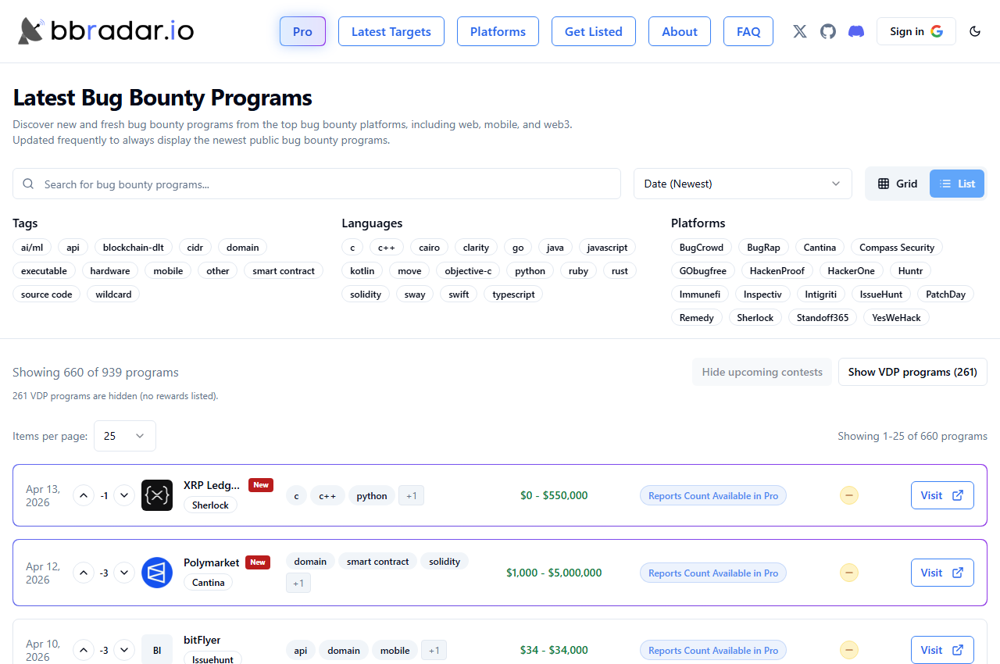
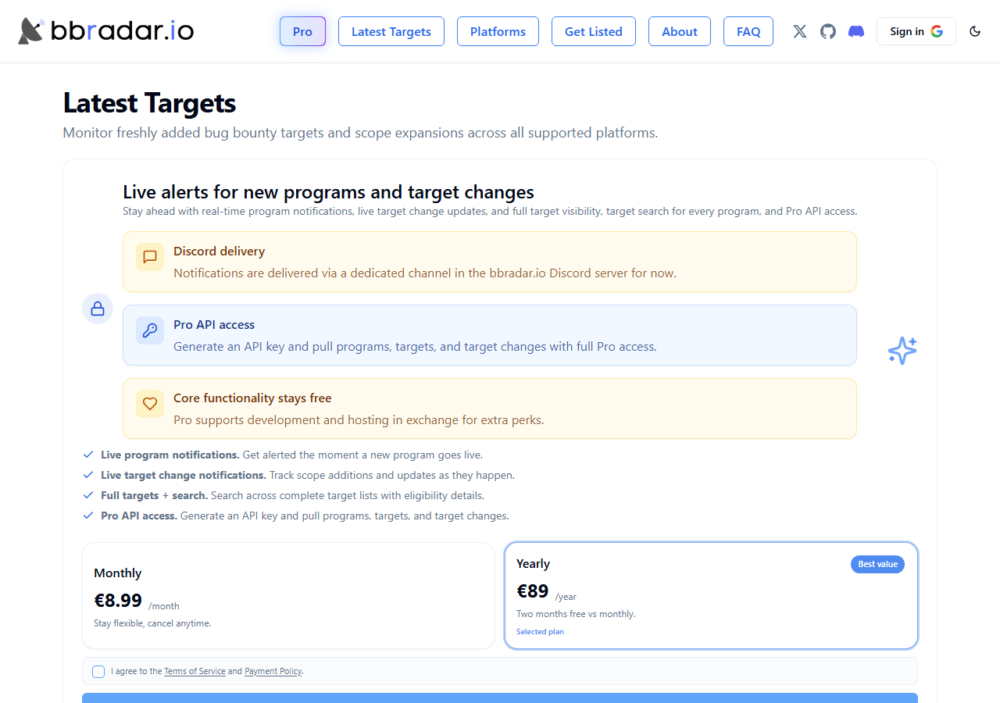

# [bbradar.io](https://bbradar.io)

The latest public bug bounty programs, target intelligence, platform stats, and Pro alerts in one place across HackerOne, Bugcrowd, Intigriti, YesWeHack, Immunefi, Inspectiv, Huntr, and many more.

📸 More Screenshots

### Latest Targets and Pro Alerts

### Platform Intelligence

### Light Mode Interface

## Website
Visit the website: https://bbradar.io

## Overview
Bug Bounty Radar (bbradar.io) is a fast, comprehensive aggregator for publicly listed bug bounty and vulnerability disclosure programs. Updated multiple times per hour with powerful filtering, target monitoring, platform intelligence, and Pro API access, it helps you discover programs that match your skills and tech stack across both Web2 and Web3 ecosystems.

## Current Highlights

<table>
  <tr>
    <td><strong>Latest Targets</strong></td>
    <td>Track target additions, removals, scope changes, eligibility, and full target lists across supported programs.</td>
  </tr>
  <tr>
    <td><strong>Platform Intelligence</strong></td>
    <td>Compare platform popularity, new-program momentum, 90-day trends, VDP share, bounty profiles, and daily snapshots.</td>
  </tr>
  <tr>
    <td><strong>Pro Alerts</strong></td>
    <td>Receive Discord notifications for new programs and target changes, with live delivery through dedicated Pro channels.</td>
  </tr>
  <tr>
    <td><strong>Pro API</strong></td>
    <td>Generate an API key and query programs, program targets, target changes, target counts, activity metadata, and report counts.</td>
  </tr>
  <tr>
    <td><strong>Community Signals</strong></td>
    <td>Vote on programs and platforms, then sort or compare by popularity, approval, and community labels.</td>
  </tr>
</table>

## At a Glance

<table>
  <tr>
    <td><strong>Scope</strong></td>
    <td>Public bug bounty and VDP listings</td>
  </tr>
  <tr>
    <td><strong>Platforms</strong></td>
    <td>HackerOne, Bugcrowd, Intigriti, YesWeHack, Immunefi, Code4rena, CodeHawks, Sherlock, HackenProof, PatchDay, Compass Security, Remedy, Standoff365, IssueHunt, BugRap, Cantina, GoBugFree, Inspectiv, Huntr</td>
  </tr>
  <tr>
    <td><strong>Program types</strong></td>
    <td>Web, API, Mobile, Smart Contracts, Blockchain, and more</td>
  </tr>
  <tr>
    <td><strong>Data points</strong></td>
    <td>Program, Platform, Type and Tags, Reward Range, Targets, Scope, Status, Date, Votes, Report Count availability</td>
  </tr>
  <tr>
    <td><strong>Filters and search</strong></td>
    <td>Keyword search, target search, tags, program type, platform filters, 15+ programming languages, AI/ML tags, smart contract tags, and more</td>
  </tr>
  <tr>
    <td><strong>Update cadence</strong></td>
    <td>Refreshes multiple times per hour ⚡</td>
  </tr>
  <tr>
    <td><strong>Access</strong></td>
    <td>Free feed and platform intelligence, Pro subscription for live alerts, full target visibility, report counts, and API access</td>
  </tr>
</table>

## Key Features

- **Unified Feed** - Track public programs across major Web2, Web3, contest, audit, and VDP platforms in one place
- **Latest Targets** - Monitor scope additions, removals, target changes, and full target lists across supported platforms
- **Live Notifications** - Get Discord alerts for new programs and target changes as they happen
- **Platform Intelligence** - Compare platform momentum, popularity, reward profiles, VDP share, daily snapshots, and 90-day trends
- **Community Voting** - Sign in with Google to vote on programs and platforms, with public popularity labels and rankings
- **Report Count Awareness** - Surface report-count metadata where available, with Pro access for premium counts
- **Pro API** - Generate an API key for programmatic access to programs, targets, target changes, and report-count metadata
- **Language Filters** - Filter programs by Python, JavaScript, TypeScript, Go, Rust, Solidity, Cairo, Clarity, Move, C, C++, Objective-C, Kotlin, Java, Sway, Swift, Ruby, and more
- **Powerful Discovery** - Filter by type, tag, platform, language, target, asset identifier, report count, votes, and VDP visibility
- **Advanced Tag System** - Filter by AI/ML, blockchain-dlt, CIDR, domain, executable, hardware, IP address, mobile, package, smart contract, source code, wildcard, and many more
- **Bounty Awareness** - Surface bounty amounts and reward ranges when available
- **Pro Subscription** - Unlock live alerts, Discord delivery, full target visibility, report counts, and API access
- **Dark/Light Mode** - Choose your preferred theme for comfortable browsing
- **Clean UX** - Minimal, fast interface built for efficient scanning and research
- **Web2 and Web3 Views** - Switch focus between ecosystems with a single click

## Pro

Pro adds live monitoring and programmatic access on top of the free public feed:

- **Live program notifications** - Get alerted when a new public program goes live
- **Live target-change notifications** - Track scope additions, updates, removals, and eligibility changes
- **Full target visibility** - Search complete target lists for every supported program
- **Report counts** - See report-count metadata when platforms expose it
- **Discord access** - Connect Discord for Pro roles and live notification channels
- **API keys** - Manage keys from your account and call `/v1/pro/programs`, `/v1/pro/programs/{id}/targets`, and `/v1/pro/targets/changes`

## Platform Intelligence

The Platforms page is now a live comparison dashboard, not just a list of sources:

- Platform popularity rankings from community votes
- Daily platform snapshots and 90-day new-program trendlines
- Active program counts, recent launches, VDP share, and reward profile summaries
- Platform-specific pages for quick filtering into the main program feed
- Free public access, with sign-in only needed when submitting votes

## Supported Platforms

<table>
  <tr>
    <td><a href="https://bbradar.io/platforms/hackerone">HackerOne</a></td>
    <td><a href="https://bbradar.io/platforms/bugcrowd">Bugcrowd</a></td>
  </tr>
  <tr>
    <td><a href="https://bbradar.io/platforms/intigriti">Intigriti</a></td>
    <td><a href="https://bbradar.io/platforms/yeswehack">YesWeHack</a></td>
  </tr>
  <tr>
    <td><a href="https://bbradar.io/platforms/immunefi">Immunefi</a></td>
    <td><a href="https://bbradar.io/platforms/code4rena">Code4rena</a></td>
  </tr>
  <tr>
    <td><a href="https://bbradar.io/platforms/sherlock">Sherlock</a></td>
    <td><a href="https://bbradar.io/platforms/hackenproof">HackenProof</a></td>
  </tr>
  <tr>
    <td><a href="https://bbradar.io/platforms/patchday">PatchDay</a></td>
    <td><a href="https://bbradar.io/platforms/compass-security">Compass Security</a></td>
  </tr>
  <tr>
    <td><a href="https://bbradar.io/platforms/remedy">Remedy</a></td>
    <td><a href="https://bbradar.io/platforms/standoff365">Standoff365</a></td>
  </tr>
  <tr>
    <td><a href="https://bbradar.io/platforms/issuehunt">IssueHunt</a></td>
    <td><a href="https://bbradar.io/platforms/bugrap">BugRap</a></td>
  </tr>
  <tr>
    <td><a href="https://bbradar.io/platforms/codehawks">CodeHawks</a></td>
    <td><a href="https://bbradar.io/platforms/cantina">Cantina</a></td>
  </tr>
  <tr>
    <td><a href="https://bbradar.io/platforms/gobugfree">GoBugFree</a></td>
    <td><a href="https://bbradar.io/platforms/inspectiv">Inspectiv</a></td>
  </tr>
  <tr>
    <td><a href="https://bbradar.io/platforms/huntr">Huntr</a></td>
    <td></td>
  </tr>
</table>

New platforms are added regularly. Want one added? Open an issue or <a href="https://twitter.com/kleoz_">DM on 𝕏</a>.

## Program Types

<table>
  <tr>
    <td><a href="https://bbradar.io/tags/api">API</a></td>
    <td><a href="https://bbradar.io/tags/blockchain-dlt">Blockchain DLT</a></td>
  </tr>
  <tr>
    <td><a href="https://bbradar.io/tags/cidr">CIDR</a></td>
    <td><a href="https://bbradar.io/tags/domain">Domain</a></td>
  </tr>
  <tr>
    <td><a href="https://bbradar.io/tags/executable">Executable</a></td>
    <td><a href="https://bbradar.io/tags/hardware">Hardware</a></td>
  </tr>
  <tr>
    <td><a href="https://bbradar.io/tags/ip-address">IP Address</a></td>
    <td><a href="https://bbradar.io/tags/mobile">Mobile</a></td>
  </tr>
  <tr>
    <td><a href="https://bbradar.io/tags/other">Other</a></td>
    <td><a href="https://bbradar.io/tags/smart-contract">Smart Contract</a></td>
  </tr>
  <tr>
    <td><a href="https://bbradar.io/tags/source-code">Source Code</a></td>
    <td><a href="https://bbradar.io/tags/wildcard">Wildcard</a></td>
  </tr>
</table>

## Why bbradar.io
Manually checking multiple platforms is slow and inefficient. bbradar.io gives you a single, unified, real-time view of new public bug bounty and VDP programs across major platforms. Discover targets faster, monitor scope changes, compare platform activity, and spend your time on research instead of tab hopping.

## Helpful Links

<ul>
  <li><a href="https://bbradar.io/pro">Pro Subscription</a></li>
  <li><a href="https://bbradar.io/account/api-docs">Pro API Docs</a></li>
  <li><a href="https://bbradar.io/latest-targets">Latest Targets</a></li>
  <li><a href="https://bbradar.io/platforms">All Platforms</a></li>
  <li><a href="https://bbradar.io/get-listed">Get Listed for platforms</a></li>
  <li><a href="https://bbradar.io/faq">FAQ</a></li>
  <li><a href="https://bbradar.io">Website</a></li>
</ul>

## Contributing
Have an idea, found a bug, or want a new platform supported? Please open an <a href="https://github.com/bbradar-io/bbradar.io/issues">issue</a>.

## Contact Kleoz

<ul>
  <li><a href="https://twitter.com/kleoz_">𝕏 or Twitter</a></li>
  <li><a href="https://discord.gg/bbradar">Discord</a></li>
  <li><a href="mailto:hello@bbradar.io">Email</a></li>
  <li><a href="https://github.com/bbradar-io/bbradar.io/issues">Issues</a></li>
</ul>

If you are a platform owner or researcher with feedback, feel free to reach out.

If you find bbradar.io useful, please star this repo and share the site. It helps other researchers discover new programs faster. 🔎
